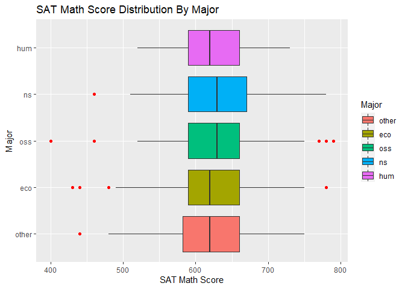

Showing off some ggplot2 skills
================
Team 09: Cyrus Tadjiki and Matt McCoy.
<<<<<<< HEAD
</br>09 April 2021
=======
</br>10 April 2021
>>>>>>> b67a2855e17288b2bf3e51206c0165bc4e6cff87

## Goal and requirements

The goal of this assignment is simple: I want you to produce *two*
different figures using **ggplot2**. They don’t have to be identify
causal relationships, or anything like that. I just want you to stretch
your visualization legs and demonstrate any new (or existing)
**ggplot2** skills that you have acquired since our first lecture.
**Important:** Both team members should contribute equally to this
assignment (e.g. repsosible for one figure each).

Some additional points:

<<<<<<< HEAD
  - You are free to use any dataset that comes in-built with base R, or
=======
-   You are free to use any dataset that comes in-built with base R, or
>>>>>>> b67a2855e17288b2bf3e51206c0165bc4e6cff87
    bundled together with an external R package. See
    [here](https://vincentarelbundock.github.io/Rdatasets/datasets.html)
    for an impressive list.

<<<<<<< HEAD
  - That being said, I would especially encourage you to use your own
    data.
    
      - I know we haven’t gotten to data importation yet, but take a
=======
-   That being said, I would especially encourage you to use your own
    data.

    -   I know we haven’t gotten to data importation yet, but take a
>>>>>>> b67a2855e17288b2bf3e51206c0165bc4e6cff87
        look
        [here](https://support.rstudio.com/hc/en-us/articles/218611977-Importing-Data-with-RStudio)
        if you need help. I would recommend that you install the
        **readr**, **read\_excel** and **haven** packages first, though.
<<<<<<< HEAD
      - If your dataset isn’t proprietary (or isn’t being read directly
        off the web), please save it in the (empty) `data/` folder of
        this repo.

  - You can use the same dataset for all four of your plots. Or you can
    use a new dataset for each plot. Regardless of what you choose, I
    want you to try and use different geoms for each figure.

  - Any other **ggplot2** skills and add-ons like faceting, changing
=======
    -   If your dataset isn’t proprietary (or isn’t being read directly
        off the web), please save it in the (empty) `data/` folder of
        this repo.

-   You can use the same dataset for all four of your plots. Or you can
    use a new dataset for each plot. Regardless of what you choose, I
    want you to try and use different geoms for each figure.

-   Any other **ggplot2** skills and add-ons like faceting, changing
>>>>>>> b67a2855e17288b2bf3e51206c0165bc4e6cff87
    aesthetic scales or legends, using different themes (e.g. from the
    **ggthemes** package), animation, etc. are all welcome and
    encouraged.

<<<<<<< HEAD
  - I want to *see* the code that produces the figures. (Don’t use
=======
-   I want to *see* the code that produces the figures. (Don’t use
>>>>>>> b67a2855e17288b2bf3e51206c0165bc4e6cff87
    `echo=FALSE` in any of the code chunks, if that means anything to
    you.)

### What you will be graded on

<<<<<<< HEAD
  - Are your figures clear? (e.g. lack of chart chunk, non-overlapping
    labels)
  - Are your figures compelling? (e.g. use an appropriate geom for the
    insight that you want to convey)
  - Variation (I don’t want to see four line charts of the same dataset…
    Be creative)
  - Did you read and follow my instructions (e.g. describe your data and
    figures, show the code that produced the figures, include data in
    the `/data` folder, etc)
  - etc.

Lastly, don’t forget to knit the assignment (click the “Knit” button, or
press `Ctrl+Shift+K`) before submitting\!
=======
-   Are your figures clear? (e.g. lack of chart chunk, non-overlapping
    labels)
-   Are your figures compelling? (e.g. use an appropriate geom for the
    insight that you want to convey)
-   Variation (I don’t want to see four line charts of the same dataset…
    Be creative)
-   Did you read and follow my instructions (e.g. describe your data and
    figures, show the code that produced the figures, include data in
    the `/data` folder, etc)
-   etc.

Lastly, don’t forget to knit the assignment (click the “Knit” button, or
press `Ctrl+Shift+K`) before submitting!
>>>>>>> b67a2855e17288b2bf3e51206c0165bc4e6cff87

## Start the assignment

Here is a R code chunk for you to load your packages. Feel free to load
as many other packages and insert as many additional code chunks
(`Ctr+Alt+I`) as you need. You can always load additional packages in
the their own chunk blocks, but I recommend loading all of your packages
together at the top.)

``` r
if (!require("pacman")) install.packages("pacman")
```

    ## Loading required package: pacman

``` r
#Install Ecdata if not already installed as it contains the dataset.
if (!require("Ecdat")) install.packages("Ecdat")
```

    ## Loading required package: Ecdat

<<<<<<< HEAD
    ## Warning: package 'Ecdat' was built under R version 4.0.3

    ## Loading required package: Ecfun

    ## Warning: package 'Ecfun' was built under R version 4.0.3
=======
    ## Warning: package 'Ecdat' was built under R version 4.0.5

    ## Loading required package: Ecfun

    ## Warning: package 'Ecfun' was built under R version 4.0.5
>>>>>>> b67a2855e17288b2bf3e51206c0165bc4e6cff87

    ## 
    ## Attaching package: 'Ecfun'

    ## The following object is masked from 'package:base':
    ## 
    ##     sign

    ## 
    ## Attaching package: 'Ecdat'

    ## The following object is masked from 'package:datasets':
    ## 
    ##     Orange

``` r
## Note: The `p_load()` function from the pacman package is a convenient way to 
## install (if necessary) and load packages all at once. You can think of this
## as an alternative to the normal `library(ggplot2); library(here);...` way of
## loading R packages.
pacman::p_load(ggplot2, here, Ecdat, dplyr)
```

``` r
#load data
data(Mathlevel)
```

``` r
# quick summary statistics

summary(Mathlevel)
```

    ##  mathlevel       sat        language      sex        major       mathcourse   
    ##  170 :164   Min.   :400.0   no :539   male  :373   other:130   Min.   :0.000  
    ##  171a: 49   1st Qu.:590.0   yes: 70   female:236   eco  :209   1st Qu.:1.000  
    ##  172a: 11   Median :630.0                          oss  :103   Median :1.000  
    ##  171b:228   Mean   :624.8                          ns   :126   Mean   :1.427  
    ##  172b: 42   3rd Qu.:660.0                          hum  : 41   3rd Qu.:2.000  
    ##  221a: 31   Max.   :790.0                                      Max.   :3.000  
    ##  221b: 84                                                                     
    ##   physiccourse    chemistcourse  
    ##  Min.   :0.0000   Min.   :0.000  
    ##  1st Qu.:0.0000   1st Qu.:1.000  
    ##  Median :1.0000   Median :1.000  
    ##  Mean   :0.7077   Mean   :1.053  
    ##  3rd Qu.:1.0000   3rd Qu.:1.000  
    ##  Max.   :2.0000   Max.   :2.000  
    ## 

``` r
head(Mathlevel, n=10)
```

    ##    mathlevel sat language    sex major mathcourse physiccourse chemistcourse
    ## 1        170 670       no   male    ns          1            2             1
    ## 2        170 660       no   male other          1            1             1
    ## 3        170 610       no female   eco          1            0             1
    ## 4        170 620      yes   male   eco          1            0             1
    ## 5        170 430       no   male   eco          0            1             1
    ## 6        170 580       no female   oss          2            1             1
    ## 7        170 550      yes female other          1            0             1
    ## 8        170 510       no female   eco          1            1             1
    ## 9        170 560      yes   male   hum          1            0             0
    ## 10       170 670       no   male   oss          1            0             1

``` r
tail(Mathlevel, n=5)
```

    ##     mathlevel sat language    sex major mathcourse physiccourse chemistcourse
    ## 605      221b 580       no female   oss          2            1             1
    ## 606      221b 770       no   male   oss          2            1             1
    ## 607      221b 660       no   male other          2            1             1
    ## 608      221b 710       no female   eco          2            0             1
    ## 609      221b 590       no female   oss          2            0             1

### Figure 1: Title description

Briefly describe the data here. Then produce the figure. **Here is my
description**

<<<<<<< HEAD
=======
We found the data from the Vincent Arel-Bundock github, and it is
located in the Ecdat package. This study collected data on the level of
calculus that had been attained by students taking Advanced
Microeconomics from 1983 to 1986. The students are also categorized by
their major. It appears to have been a fairly small cross-sectional
study as there are only 609 observations.

>>>>>>> b67a2855e17288b2bf3e51206c0165bc4e6cff87
``` r
# Plot code here
```

Finally, tell me what I am looking at. Point out anything that you think
is of interest. Now do the same for Figs. 2 below…

<<<<<<< HEAD
### Figure 2: Title description

``` r
# Plot code here
```
=======
### Figure 2: Distribution of SAT Math scores By Major

``` r
# Plot code here

ggplot(Mathlevel) +
  aes(x = sat, y = major, fill = major) +
  geom_boxplot(outlier.color="red") + labs(title = "SAT Math Score Distribution By Major", x = "SAT Math Score", y = "Major", fill = "Major") 
```

<!-- --> This Boxplot depicts
the distribution of SAT math scores within each of the majors. I was
curious to see if there would be any correlation between specific majors
and higher math scores. It does not appear that math scores influence
what major someone picks as each major has a very similar distribution
and interquartile range. The Natural Sciences does have an edge on the
upper whisker indicating that their top 25% of scores are slightly
higher. The Economics and Other majors had a slightly worse lower
whisker score indicating there are slightly more low scores. The
outliers are highlighted as a red dot. It’s interesting that there are
no outliers in the Humanities major, and they have the most compact
distribution of scores. The spread of math scores is fairly symmetrical
between group, and the data is not skewed in either direction.
>>>>>>> b67a2855e17288b2bf3e51206c0165bc4e6cff87
